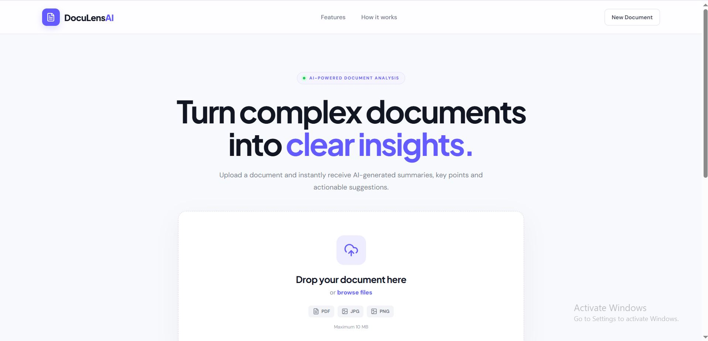
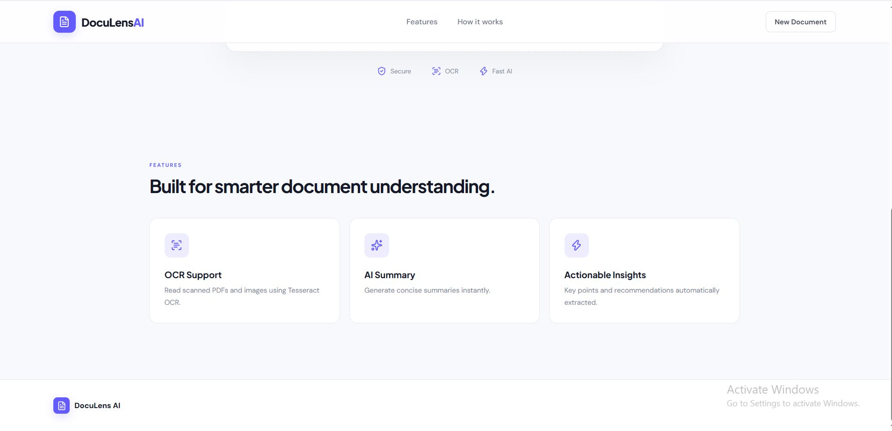
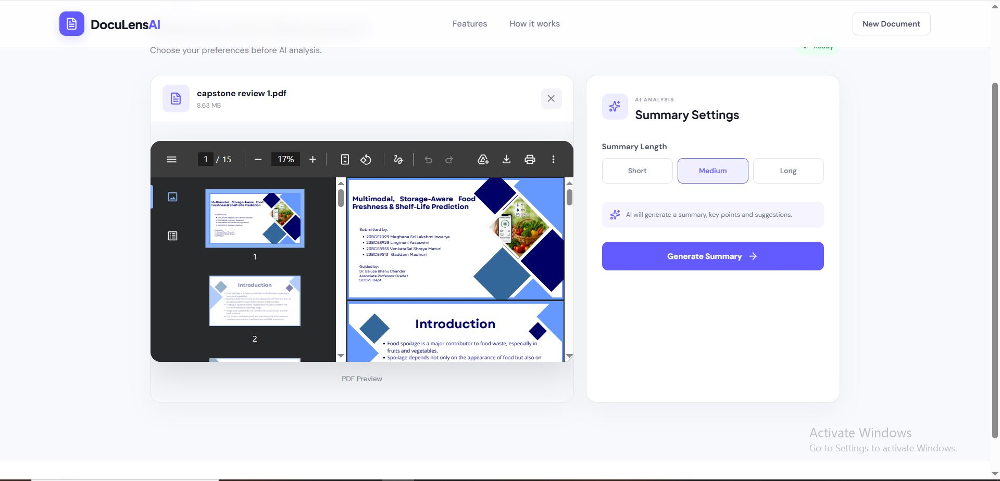
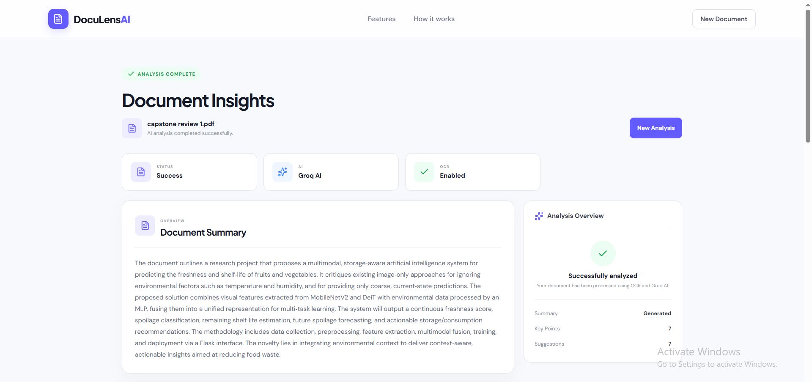
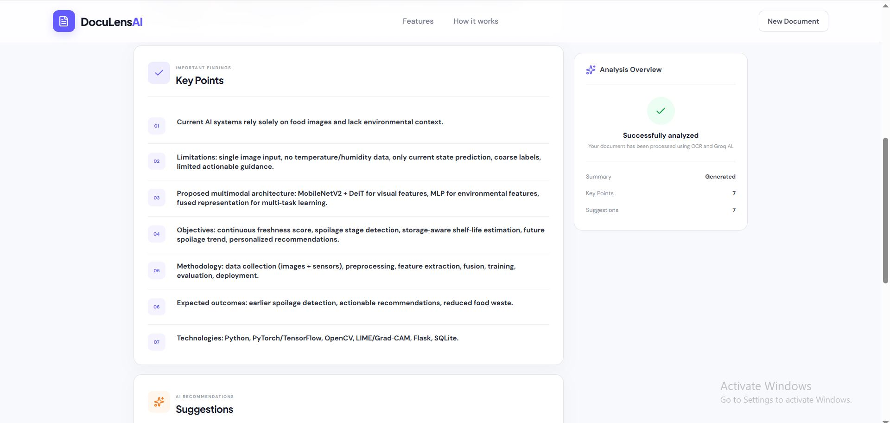
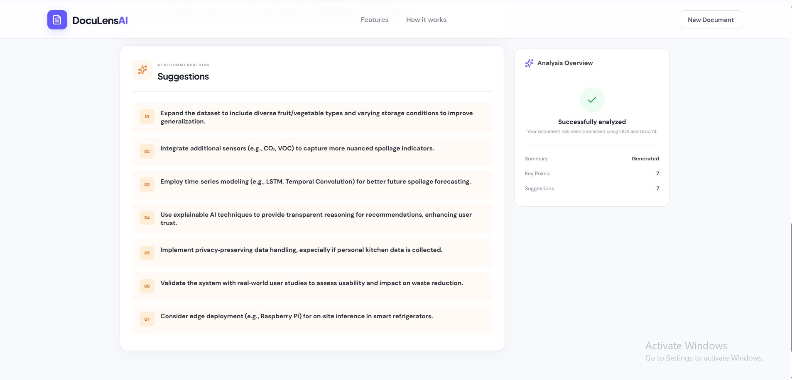

# 🚀 DocuLens AI – Intelligent Document Summarizer

> AI-powered document analysis application that extracts text from PDFs and images, performs OCR on scanned documents, and generates intelligent summaries, key points, and actionable suggestions using Google Gemini AI.

## 📌 Overview

DocuLens AI is a full-stack AI application that simplifies document understanding by transforming lengthy PDFs and images into concise insights within seconds.

The application supports both digital and scanned documents by combining **PyMuPDF**, **Tesseract OCR**, and **Google Gemini AI** to provide accurate summaries and meaningful recommendations through a modern React-based interface.

---

## ✨ Features

- 📄 Upload PDF documents
- 🖼️ Upload JPG & PNG images
- 🔍 OCR support for scanned documents
- 🤖 AI-generated document summaries
- 📌 Automatic key point extraction
- 💡 AI-powered improvement suggestions
- 📱 Fully responsive modern UI
- ⚡ FastAPI backend with REST API
- 🔒 Secure file processing

---

## 🛠️ Tech Stack

| Category | Technology |
|----------|------------|
| Frontend | React (Vite) |
| Styling | CSS3 |
| Backend | FastAPI |
| AI Model | Google Gemini |
| OCR | Tesseract OCR |
| PDF Processing | PyMuPDF |
| HTTP Client | Axios |

---

## 🏗️ Project Architecture

```text
                User Upload
                     │
                     ▼
            React Frontend (Vite)
                     │
              Axios API Request
                     │
                     ▼
              FastAPI Backend
                     │
         ┌───────────┴───────────┐
         │                       │
         ▼                       ▼
    PyMuPDF (PDF)         Tesseract OCR
         │                       │
         └───────────┬───────────┘
                     ▼
            Google Gemini AI
                     ▼
      Summary • Key Points • Suggestions
```

---

## 📂 Project Structure

```text
doculens-ai/
│
├── backend/
│   ├── main.py
│   ├── services/
│   │   ├── ai_service.py
│   │   ├── pdf_service.py
│   │   └── ocr_service.py
│   ├── uploads/
│   ├── requirements.txt
│   └── .env
│
├── frontend/
│   ├── src/
│   │   ├── App.jsx
│   │   ├── App.css
│   │   └── services/
│   │       └── api.js
│   ├── public/
│   └── package.json
│
└── README.md
```

---

## ⚙️ Installation

### 1. Clone the Repository

```bash
git clone https://github.com/Ishu2311/Document_summary.git
cd Document_summary
```

### 2. Backend Setup

```bash
cd backend

python -m venv venv

# Windows
venv\Scripts\activate

pip install -r requirements.txt

uvicorn main:app --reload
```

Backend runs at:

```text
http://127.0.0.1:8000
```

### 3. Frontend Setup

Open another terminal.

```bash
cd frontend

npm install

npm run dev
```

Frontend runs at:

```text
http://localhost:5173
```

---

## 🔑 Environment Variables

Create a `.env` file inside the `backend` folder.

```env
GEMINI_API_KEY=YOUR_GEMINI_API_KEY
```

> Never upload your `.env` file to GitHub.

---

## 📷 Screenshots

### 🏠 Landing Page





### 📤 Upload Workspace



### 🤖 AI Results Dashboard

#### Document Summary



#### Key Points



#### Improvement Suggestions



## 📡 API Endpoint

### Analyze Document

**POST**

```text
/api/analyze
```

Supports:

- PDF
- JPG
- PNG

Example Response:

```json
{
  "filename": "sample.pdf",
  "summary": "...",
  "key_points": [
    "...",
    "..."
  ],
  "suggestions": [
    "...",
    "..."
  ]
}
```

---

## 🚀 Future Improvements

- PDF download for generated summaries
- Multi-language document support
- Batch document processing
- User authentication
- Cloud deployment
- AI chat with uploaded documents

---

## 🎯 Key Highlights

- Full-stack AI application
- OCR-enabled document processing
- Gemini AI integration
- Responsive modern UI
- RESTful FastAPI backend
- Production-style project architecture

---

## 👨‍💻 Author

**Iswarya Madala**

GitHub: **[@Ishu2311](https://github.com/Ishu2311)**

---

## ⭐ Support

If you found this project useful, consider giving the repository a ⭐ on GitHub.
